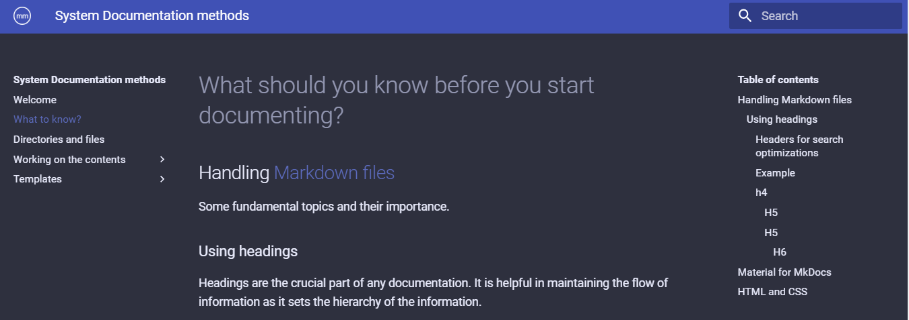

# What should you know before you start documenting?

##Handling <a href="https://www.markdownguide.org/getting-started/" target="_blank">Markdown files</a>
    
Some fundamental topics and their importance.

###Using headings

Headings are the crucial part of any documentation. It is helpful in maintaining the flow of information as it sets the hierarchy of the information.


#### Headers for search optimizations
Headers are crucial part of the documentation. They are indexed for the documentation search. Any information inside the header can be easily found by using the main search.

!!! tip 
    See how the information hierarchy is set for navigation on the right panel <span style = "font-size:40px">:point_right:</span> .

####Example
#### h4

##### H5

##### H5

###### H6


     


 
##<a href="https://squidfunk.github.io/mkdocs-material/getting-started/" target="_blank">Material for MkDocs</a>

<a href="https://squidfunk.github.io/mkdocs-material/getting-started/" target="_blank">Material for MkDocs</a> provides different methods for using mkdocs features in a very enhanced way. Use it to enhance the way you present the documentation. All the code samples for the features that are used in the overall documentation can be found there.

  
##HTML and CSS

All the contents of the markdown are rendered on the web browser. So it is an additional point to know HTML and CSS. For example :
<div style = "background-color:green; border:2px solid black;">
<p style = "text-align:center;">This text is a `<p>` element of html which includes some inline styles.</p>
</div>

The following is the code that generates the above output
```
<div style = "background-color:green; border:2px solid black;">
<p style = "text-align:center;">This text is a `<p>` element of html which includes some inline styles.</p>
</div>
```

It can be useful for example in the case of labelling an image and positioning the text right on the center.
<div style = "border:1px solid #666">

</div>
<p style = "text-align:center;"><i>A screenshot for the current page</i></p>

<span style = "font-size:40px;">Not mandatory,</span><span style = ""> but can be helpful</span>
