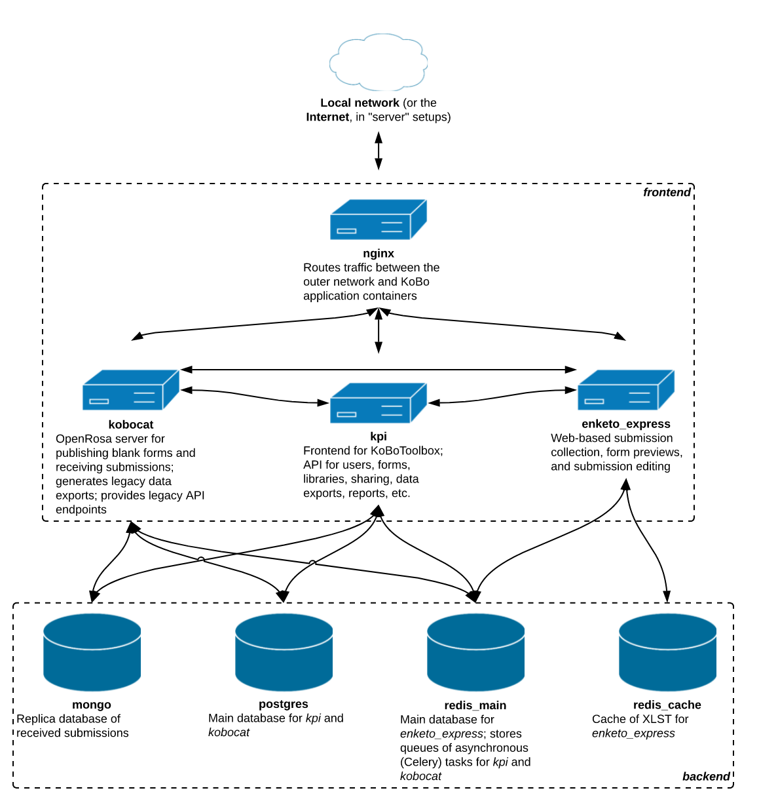

#Architecture Overview

## General overview
###Kobotoolbox
KoBoToolbox consists of the following components, all of which are open source (see links for source code):

**kpi** - for creating survey forms and reusing assets through a question library.

**kobocat** and kobocat-templates - for deploying surveys, collecting, and analyzing data.

**enketo-express** - HTML5 Web app for collecting data, previewing forms, editing data submissions.

**kobocollect** - Android app for collecting data.
KoBoToolbox is based on elements from several other open source tools, most importantly pyxform, formhub/onadata, and the OpenDataKit. As a result, all forms and collected data are compatible with these tools.

## Architecture and data flow 

### Architecture / data flow diagrams

<i>Koboform system architecture</i>

### Data flow processes
### Module components

###kobo-docker
    system  dockers
    30-init-kobo-nginx.sh this file in kobo-docker seems to have nginx configuration

### kobo-install

### Dashbord (Digital Profile)

**Admin Panels**
http://digitalprofile.qbitsx.com/admin
http://kf.qbitsx.com/admin
http://kc.qbitsx.com/admin

users in all  these  admins are synced from  digitalprofile project using  signals every time we create any new user

## References

**Digitalprofile api documentation**
[Click here](https://github.com/dolpotech/digitalprofile/tree/master/documentation/api)

