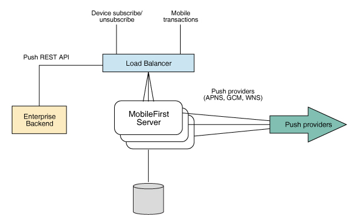

#Notification

## General overview

The notification system contains the complete management of notification in the server as well as client side.
###Types
 - Foreground notification
 - Background notification
       
    Where background notification is used for notifying the client app about when data changes.

### Notification firing
The notification is fired to :
 
1.  send reports
2.  notify  for scanning

## Architecture and data flow 

### Architecture / data flow diagrams

<i>Notification system architecture</i>

### Data flow processes
### Module components

## Classes and methods

### Class 1

#### `Method 1`
#### `Method 2`
#### `Method 3`
#### `Method 4`

## Database schema

See the full overview of database [here](./database/overview.md)

### References

Any tutorials or external references that are to be taken under consideration.

### Appendix
The appendix helps provide the full insight overall technologies and concepts used by the particular module. 