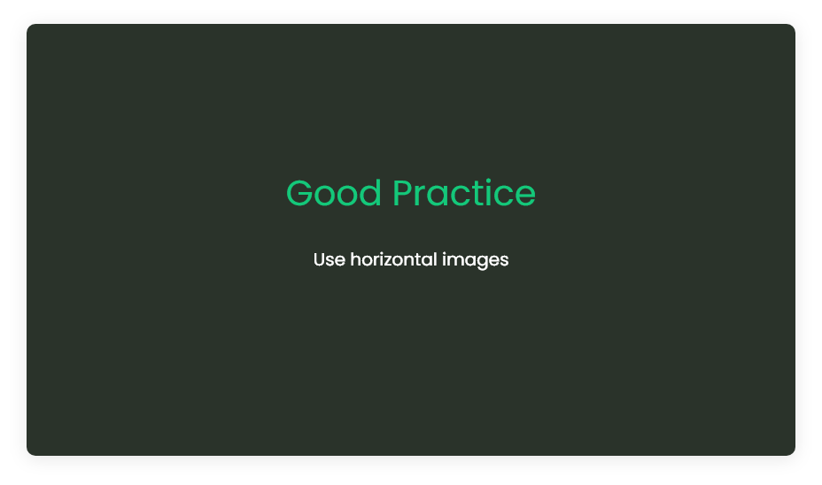
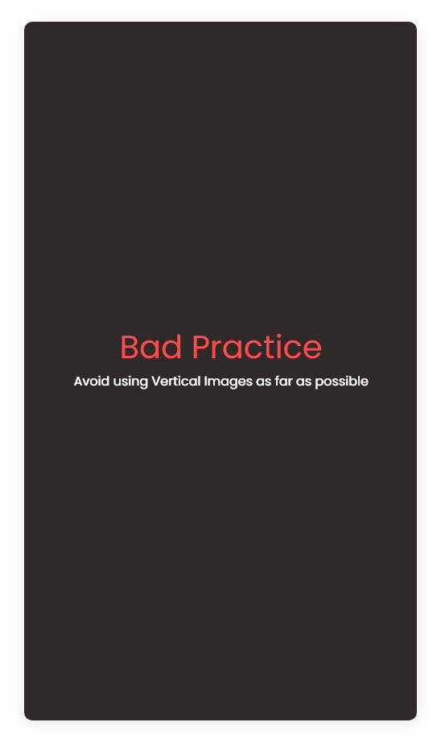

#How to document the right way ?

##Approach for documentation

Working on a project and preparing the documentation can be very tedious. Follow these steps for effeciently documenting works.

-   Break the work into sections
     
     Making a documentation for the whole project is not possible and there are high chance of missing things out. So instead make chunks of works, complete them, cleanup and start documenting them.
     
-   Collect image snapshots and place them in the directories first
       
??? note "Image directory"            
    ```
        docs
        ├───assets
        ├───contents
        │   ├───main
        │   │   ├───assets  -- store image for the section "main"
        │   │   └───pages
        │   └───sections
        │       ├───section_1
        │       │   ├───assets  --- store image for the section "section_1"
        │       │   └───pages
        │       ├───Worked_out_methods
        │       │   ├───assets  --- store image for the section "worked out methods"
        │       │   └───pages
        │       └───working_on_the_contents
        │           ├───assets  --- store image for the section "working_on_the_contents"
        │           └───pages
        └───overrides
    ```
    
    !!! info "Might help!" 
        See [Directories and files](../../../main/pages/directories_and_files.md) for full directory overview.
    
- Provide links and navigations

    Try to present the idea for the best possible experience to navigate through references.                              
    Giving references is helpful such as this example that jumps straight into the [Welcome](../../../index.md) section.

     
## Practices

###Including directory tree

Going along the docs without knowing exactly the location of every file can be difficult. So, the best way is to provide the tree structure of the directory that is being explained.
 
Here's is what to keep in mind while including the tree directory.

- The tree directory should be displayed block only if it very important on the context like [this](../../main/pages/directories_and_files.md). Otherwise it should be displayed in a collapsible block as shown below :

??? note "Content directory tree (project_dir/docs/contents)"
    You can provide a short description here if required.
    ```
    contents
    ├───main
    │   ├───assets
    │   └───pages
    └───sections
        ├───templates
        │   ├───assets
        │   └───pages
        ├───worked_out_methods
        │   ├───assets
        │   └───pages
        ├───working_on_the_contents
        │   ├───assets
        │   └───pages
        └───_section_template
            ├───assets
            └───pages
    
    ```            


###Inserting Images

As far as possible use image with horizontal aspect ratio of 9:16, 3:4, or 1:1.

??? check "Good practice"
    

??? fail "Bad practice"
    


